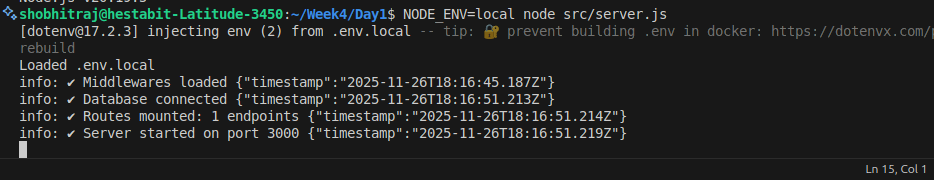

# Day 1 — Express App Setup, Loaders, Config, Routing & Project Structure

This project sets up a clean, scalable Node.js backend architecture using Express, modular loaders, configuration management, routing, and logging utilities.  
Day 1 establishes the base structure for the entire backend.

---

## Project Structure

---
## What Was Completed on Day 1

### 1. Express Server Setup
A basic Express application was initialized using a modular architecture.

### 2. Loaders Pattern Implemented
Loaders were introduced to keep the app clean and maintainable.

Loaders include:
- `express.js` – sets up JSON parsing, CORS, basic middlewares.
- `routes.js` – mounts routes under `/api`.
- `app.js` – composes all loaders and returns an app instance.

### 3. Environment Configurations
A `.env.local` file was created for:
- `PORT`
- `NODE_ENV`

Configuration is handled in `src/config/index.js`.

### 4. Logger Setup
A custom logger (`logger.js`) logs:
- Server initialization
- Middlewares loading
- Routes mounted

### 5. Base Routes
A simple health route was implemented:

