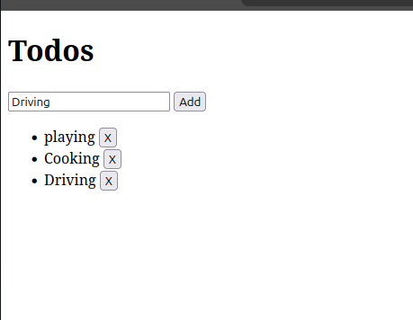
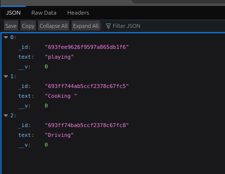

# 🚀 Day 5 — CI-Style Deployment Automation (Capstone)

## 📌 Project Overview
This project demonstrates a **production-style full-stack application deployment** using **Docker, Docker Compose, NGINX (reverse proxy), HTTPS, and MongoDB**.

A **single domain** (`mysite.local`) is managed by **NGINX**, which:
- Terminates HTTPS
- Serves the frontend UI
- Routes backend API requests using path-based routing (`/api`)

The setup follows **real-world production practices** such as containerization, persistent storage, health checks, restart policies, and CI-style automation.

---

## 🧱 Tech Stack

| Layer | Technology |
|-----|-----------|
Frontend | Static HTML + JavaScript |
Backend | Node.js + Express |
Database | MongoDB (Dockerized) |
Reverse Proxy | NGINX |
Containerization | Docker & Docker Compose |
HTTPS / TLS | mkcert (local trusted CA) |

---

## 🌐 Architecture (Single Domain)

Browser (https://mysite.local
)
|
v
NGINX (HTTPS Reverse Proxy)
|
├── / → Frontend Container
├── /api/* → Backend Container
└── /health → Backend Health API
|
v
MongoDB (Docker)


---

## 🔐 HTTPS Setup (Local)

- Domain used: `mysite.local`
- HTTPS certificates generated using **mkcert**
- Certificates trusted in browser via `mkcert -install`
- NGINX performs TLS termination

---

## 📂 Project Structure

Day5/
├── docker-compose.prod.yml
├── deploy.sh
├── .env
├── .env.example
├── nginx/
│ ├── nginx.conf
│ └── certs/
├── frontend/
│ ├── Dockerfile
│ └── index.html
├── backend/
│ ├── Dockerfile
│ ├── index.js
│ └── package.json
└── mongo-data/ # MongoDB persistent data (bind mount)


---

## ⚙️ Environment Variables

### `.env` (not committed)
```env
NODE_ENV=production
PORT=3000
MONGO_URI=mongodb://mongo:27017/todos

```
## Deploy (CI-Style Automation)

```bash
chmod +x deploy.sh
./deploy.sh
```


## Applicaion urls


| Purpose        | URL                                  |
|---------------|--------------------------------------|
| Frontend UI   | https://mysite.local                 |
| Backend API   | https://mysite.local/api/todos       |
| Health Check  | https://mysite.local/health          |


## 📸 Screenshots (Add These for Submission)

### 1️ Frontend UI (HTTPS Proof)

**URL:**  
https://mysite.local

**Show:**  
- Secure lock (🔒) in the browser  
- Todo UI with at least one item  

**Screenshot:**  



### Backed Api Response 

**URL:**  
https://mysite.local/api/todos

**Show:**  
- json response with stored todos

**Screenshot:**  

